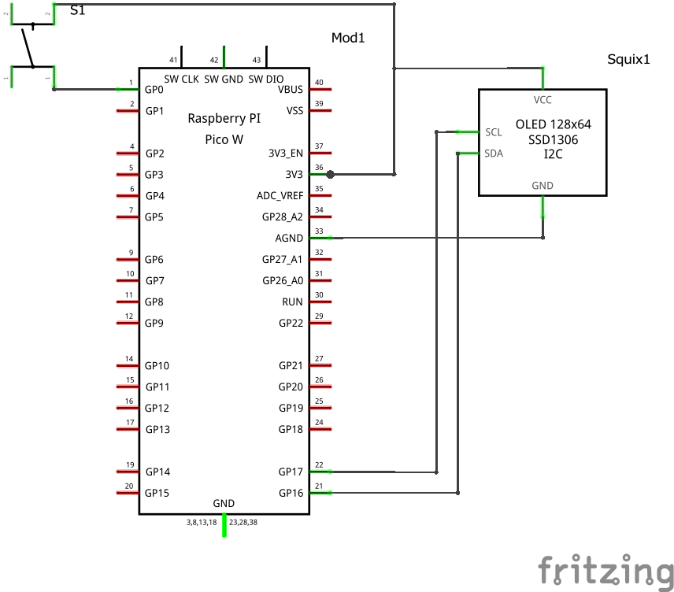
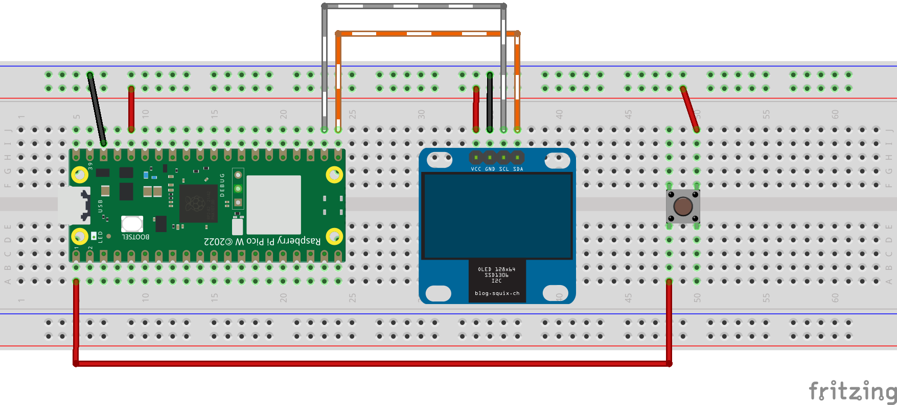
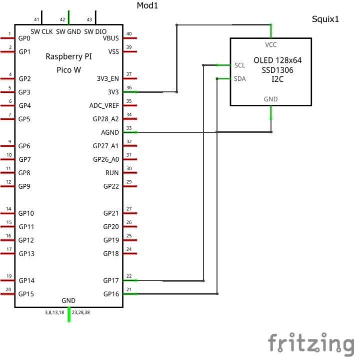
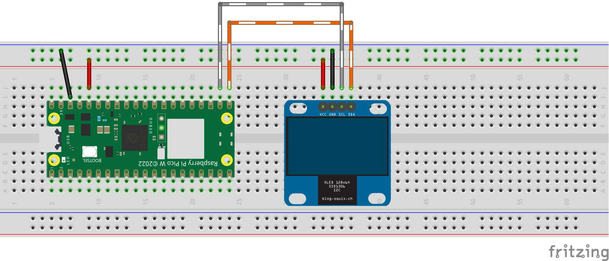

# OSWaLD

**O**FF-**S**witch **W**ith **L**ED and **D**isplay

## Definition

The purpose of this device shall be an **OFF-Switch**, which is located at the exit of an automated building.

When I leave the building, I push the **OFF-Button**.

**OSWaLD** sends this request to the Automation Unit of the building. The Automation Unit checks if there is any window open.

If this check is ok, an **green LED** near the Off-Switch indicates all is ok. This is the signal for the **Home Automation Unit** that all lights can be shut off.

If this check fails, an **red LED** blinks, also there is a **display** which shows a message like "Please close the window in the main entrance"

The Logic will be implemented in the **Home Automation Unit**. OSWaLD will connect over built-in WIFI
Communication over MQTT.

This Project is in progress...

## Contents of OSWaLD

- Microcontroller
  - Raspberry Pi Pico WH
    - with WLAN
- Push-Button
- green LED
- red LED
- Display for Messages
## V02: Adding Push-Button, starting firmware
### Hardware

### Software
#### Main Program main.py
 
#### Library ssd1306.py
* have to be copied to the Pico

## V01: Raspberry Pico with SSD1306 Display

### Hardware

### Software

#### Library ssd1306.py

* have to be copied to the Pico

#### Testprogram temperature.py

- works fine
